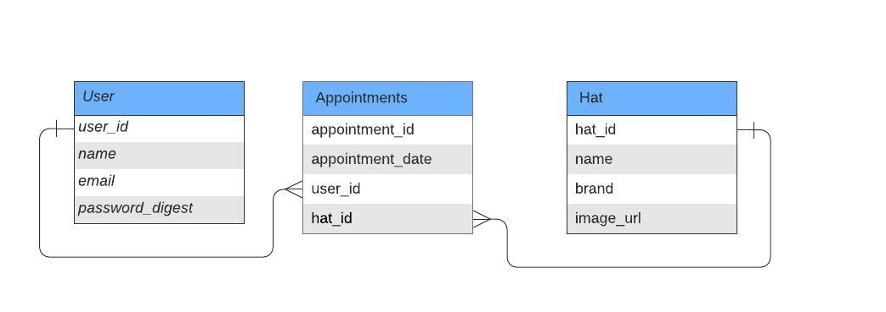

# Book-a-hat-appointment

## About

This is an API to provide the api endpoint for user to create an appointment app to try a hat so user can choose which hat to try and when.

The ER diagram used to create the model for this project is as below:



## Features

The features of this project are, user can:

1. register and login.
2. Perform CRUD operation for appointments.
3. Get appointments and update them.

## API Guide

### Authorization

Authorization is required for all endpoints except `/hats`.

1. **How to get the authorization token?**

To get the authorization token user should register using endpoint `/signup`. If they have an account they can call the `/login` api to get the token.

2. **How the token should be passed?**

Once user have the token they can pass it on every request header as below:

```
Authorization: Token {user_token}
```

### API endpoints

Below is the information regarding api endpoint to use.

#### Login and Register

1. `/api/login`

   - Request verb: `POST`
   - Action: login
   - Request body parameters:

     ```
     {
       "user": {
         "email": "example@mail.com",
         "password": "test123"
       }
     }
     ```

   - Response:
     ```
     {
       "user": {
         "id": 1,
         "email": "example@mail.com",
         "token": "jwt_token"
       }
     }
     ```

1. `/api/auth/login`

   - Request verb: `POST`
   - Action: POST
   - Request body parameters:

     ```
     {
         "user": {
           "email": "example@mail.com",
           "password": "test123"
         }
     }
     ```

   - Response:
     ```
     {
         "user": {
           "id": 1,
           "email": "example@mail.com",
           "bio": "user bio",
           "token": "jwt_token"
         }
     }
     ```

#### End point for hats

1. `/api/hats`

   - Request verb: `GET`
   - Action: Get all hats
   - Request body parameters: `null`
   - Response:

   ```
     [
       {
         "id": 1,
         "brand": "doro",
         "name": "doro-signora",
         "image_url": "https://images.pexels.com/photos/10101936/pexels-photo-10101936.jpeg?auto=compress&cs=tinysrgb&dpr=2&h=650&w=940",
         "created_at": "2021-11-05T12:29:24.182Z",
         "updated_at": "2021-11-05T12:29:24.182Z"
       },
       {
         "id": 2,
         "brand": "sherif",
         "name": "sherif hat",
         "image_url": "https://images.pexels.com/photos/10093300/pexels-photo-10093300.jpeg?auto=compress&cs=tinysrgb&dpr=1&w=500",
         "created_at": "2021-11-05T12:29:24.189Z",
         "updated_at": "2021-11-05T12:29:24.189Z"
       },
       {
         "id": 3,
         "brand": "cavaliery",
         "name": "dom cavaliery",
         "image_url": "https://images.pexels.com/photos/1687719/pexels-photo-1687719.jpeg?auto=compress&cs=tinysrgb&dpr=1&w=500",
         "created_at": "2021-11-05T12:29:24.194Z",
         "updated_at": "2021-11-05T12:29:24.194Z"
       },
       {
         "id": 4,
         "brand": "daisy",
         "name": "daisy sweet",
         "image_url": "https://images.pexels.com/photos/10057623/pexels-photo-10057623.jpeg?auto=compress&cs=tinysrgb&dpr=1&w=500",
         "created_at": "2021-11-05T12:29:24.200Z",
         "updated_at": "2021-11-05T12:29:24.200Z"
       },
       {
         "id": 5,
         "brand": "mediterrani",
         "name": "meditarrani signore",
         "image_url": "https://images.pexels.com/photos/10075340/pexels-photo-10075340.jpeg?auto=compress&cs=tinysrgb&dpr=1&w=500",
         "created_at": "2021-11-05T12:29:24.206Z",
         "updated_at": "2021-11-05T12:29:24.206Z"
       }
     ]
   ```

## Live Demo

This project is hosted on heroku.

[Live demo link](https://twitter-design.herokuapp.com/)

## Built With

- Ruby
- Rails
- postgresql

## Getting Started

### Prerequisites

If you intend to download the project, you will need to have

1. Ruby

   For more information on how to install Ruby, follow [this link](https://www.ruby-lang.org/en/downloads/)

2. Ruby on rails

   After ruby is installed run cmd `gem rails`

3. postgresql

   For installing postgresql [follow this link](http://postgresguide.com/setup/install.html)

### Installation instructions

Follow along the steps below to get a copy at your local machine.

- Navigate to the directory where you want this project to clone and then clone it

  ```
  git clone https://github.com/helciodev/book-a-hat-appointment.git
  ```

- Navigate to the `book-a-hat-appointment` directory

  ```
  cd book-a-hat-appointment
  ```

- install the gem package

  ```
  bundle install
  ```

- install npm packages

  ```
  npm install
  ```

- Create your database

  ```
  rails db:create
  ```

- Migrate the database

  ```
  rails db:migrate
  ```

- Start your server

  ```
  rails server
  ```

- Open browser at http://localhost:3000/

## Testing

To test the project run the below cmd from your project root directory.

```
rspec

OR

rspec --format doc
```

If you want to populate initial hat data instead of creating it for manual testing you can run

```
rails db:seed
```

## Authors

👤 **Helcio Andre**

- GitHub: [@helciodev](https://github/com/helciodev)
- Twitter: [@helcio_bruno](https://twitter.com/helcio_bruno)
- LinkedIn: [Helcio Andre](https://www.linkedin.com/in/helcio-andre)

## 🤝 Contributing

Contributions, issues, and feature requests are welcome!

## Show your support

Give a ⭐️ if you like this project!

## 📝 License

This project is [MIT](./LICENSE) licensed.
